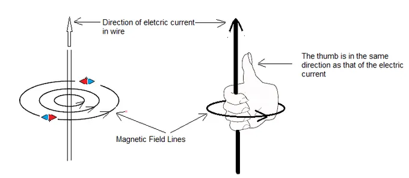
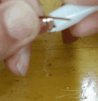
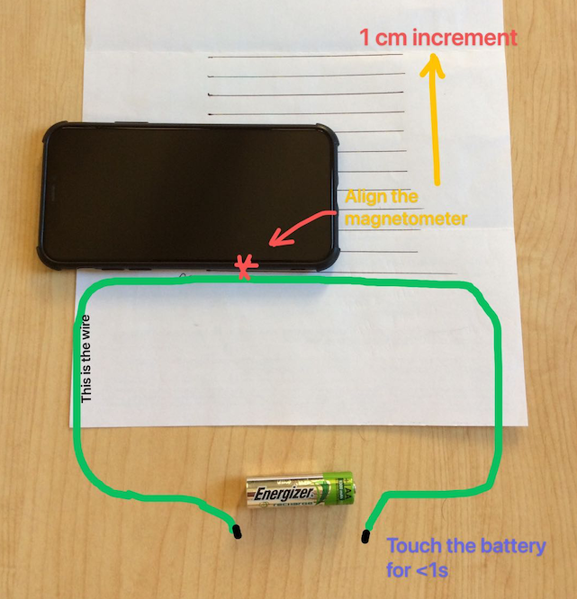
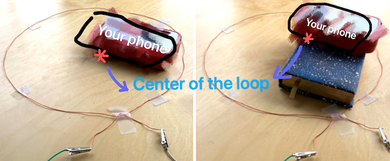

# Lab 2: Magnetic Field
---
### Materials needed for entire lab:
- Phyphox
- A wire (~0.8-1 m)
- AAA or AA battery
- Some vertical support (e.g., a book)
- Paper and ruler

---
# The Biot-Savart Law

In the previous lab, we looked at how moving electric charges feel force in the presence of external electric and magnetic fields. Continuing with the theme of electrodynamics, we will look at the fields and forces caused by moving charges *themselves*.

As you may know, moving charges not only have electric fields, $\vec E$ associated with them, but also produce magnetic fields, $\vec B$ in directions tangent to their velocity. The characterization of such $\vec B$ fields for a single moving charged particle is actually trickier than you would expect -- the motion of the point-like charged particle and constant generation of a magnetic field at every point in time requires relativity to describe correctly -- and will be dealt with in a more advanced course.

It turns out, however, that a *line* of moving charges, such as a current-carrying wire, is much simpler to work with: the resulting magnetic field has a static and well-defined description in terms of the Biot-Savart Law:

:::Figure:Equation biot_law

$$
\vec B = -\frac{\mu_0 I}{4\pi} \int_C    \frac{\vec r \times d\vec\ell }{|\vec r|^3}
$$

:::

In this lab, we will explore the Biot-Savart law by indirectly determining *the current* in a wire by *measuring the magnetic field*  it produces. We will focus on two simple setups, a long straight wire and a loop of current,  whose integrals result in a simple expression for the magnetic field.

### Long Straight Wire

::: Figure:Simulation
<iframe src="https://kapawlak.github.io/PhDemoJS/Apps/BiotSavart_Current_Line/Biot_Savart.html" width= "100%" height="650" style="border:none;"></iframe>
:::

Recall that for a long straight wire, the magnetic field wraps around the line of current according to the right-hand rule [Eq](#biot_law):

:::Figure:Figure

:::

Analyzing the integral of the Biot Savart Law,  it can be shown that the strength of the magnetic field at a distance $R$ from the wire is given by the equation:

::: Figure:Equation biot_wire
$$
B = \frac{\mu_0 I}{2 \pi R} 
$$
:::
where the magnetic permeability of free space is $\mu_0 = 4\pi\times 10^{-7}$ T&middot;kg/A

### Loop of Wire
::: Figure:Simulation

<iframe src="https://kapawlak.github.io/PhDemoJS/Apps/BiotSavart_Current_Loop/Biot_Savart.html" width= "100%" height="650" style="border:none;"></iframe>

:::

For a  loop of wire, the magnetic field looks very similar to that of a dipolar magnet. When the loop is large, the mangnetic field in the center of the loop looks approximately like a straight line piercing the loop, with a direction determined by the right hand rule. The strength of this field depends on the radius of the loop and the height, given by the relation:

::: Figure:Equation biot_loop
$$
B = \frac{\mu_0 I}{2} \frac{R^2}{(R^2+z^2)^{3/2}}
$$
:::

# Experiment

## 1. Prelab setup

Since we are making direct and quantitative measurements of a magnetic field in this lab, it is important to know the exact location of the magnetometer in your phone -- recall how you find it in Lab 0. Try to be as accurate as possible when you find the location. The offset between the label and its true location results in a deviation from expected behavior when you were doubling the distance to your magnetic source! As you conduct the experiment, you will need to use the coordinates ($x, y, z$) of its position. Keep these measurements in mind while performing the experiment and doing the calculation. 
######
As in Lab 0, we must subtract the background filed to ensure the accuracy of the measurements. Also, try to stay away from metals (e.g., the frame under many desks) since these will distort the Earth’s magnetic field and add extra components to the readings.

####

::::::Note
 If the long wire you have is *enameled*, it must be scraped off at the contact points, else the circuit will **NOT** conduct. The safest way to do this is to grip the ends of each wire with the alligator clips (or something similar), squeeze them closed, and pull. Doing this a few times should scrape off enough enamel to allow sufficient conduction.

:::Figure:Figure

:::

::::::

## 2. Long straight wire

### Materials needed:
- phyphox
- A wire (~0.8-1 m)
- AAA or AA battery
- Paper and ruler

::::::::: Exercise
In this geometry, the wire is sitting flat on the desk, parallel to the side of your phone with the magnetometer. 
::: Question
Assuming your phone has a small thickness, i.e., the height of the magnetometer is ignorable, what B component(s) do you expect to observe from the current carrying wire in this configuration?
:::

::: Figure:Figure

:::

1. On a piece of paper, draw 10 locations spaced 1 cm apart. These will be the locations you will measure the $B$ field strength. Note that it is easier to align the phone and correct your distances for the magnetometer offset after collecting data -- the correction will be the same for each distance measurement.  Once everything is set up correctly, as shown, you may begin taking data. 
3. Align the side of the phone with the magnetometer to a given measurement line.  
4. Open phyphox - magnetometer.
5. Begin recording and you should see three straight lines for three components.
6. Briefly touch the wires to the battery terminals for no more than 1 second. This prevents overheating and battery drain. 
7. Stop recording.
8. You should see a narrow dip on at least one of the plots.
::: Question
Do the dip(s) match your prediction from question 1? Comment if the assumption can be made or not.
:::

9. Repeat steps 5-8 for the remaining 9 measurement lines.
######

:::Note
   **Note:**  If you are doing the experiment on a desk with a steel frame or there are metals nearby, the baseline $B$ field will shift as the phone is moved over different regions of the desk (why?).  If you are unable to find an alternate location to perform the experiment, it is possible to correct for the error by measuring the $B$ field components both before and during each current pulse, and then finding the difference. This difference will be the field due to just the current. 
 :::

::::::Question
Review your data and make a table like the one below with appropriate units.

**Note**: whether you have $B_y$ component or not depends on your observations in question 1 & 2. If you do observe $B_y$, don't forget to consider the height of the magnetometer in your calculation of $R$!

::::::
:::Figure:Table

|Offset  $y$  | $R$ |$1/R$  | Measured $B_y$ *  |Measured $B_z$  | Field strength $B$ |
|------|------|------|------|------|------|
|@fa-pencil@    |      |      |      |      |      |     
|@fa-pencil@   |      |      |      |      |      |   
|@fa-pencil@    |      |      |      |      |      |   
|@fa-pencil@   |      |      |      |      |      |        

:::

:::::::::

::: Question
1. Plot B vs. 1/R. 

2. Why should the slope of this curve give you a measure of the current, I?

3. Determine the current $I$ from this slope. Report it in the correct units and to a reasonable number of significant figures.

4. From Ohm&rsquo;s law and the voltage of your battery, estimate the resistance of your setup. 

5. Does it seem reasonable? Why or why not?
:::

::: Question
1. Assuming that you performed the experiment correctly, what do you think is your largest source of *uncertainty*? 

2. Estimate how much might it affect your results.
:::

## 3. Loop of wire

### Materials needed:
- phyphox
- A wire (~0.8-1 m)
- AAA or AA battery
- Some vertical support (e.g., a book)

:::::: Exercise
We will now measure the magnetic field induced by a loop of current.
::: Figure:Figure

:::

1. Tape your long wire to a table so that it forms a closed loop. Try to make the loop as circular as possible. Record the radius of the loop.
2. Align your phone such that the magnetometer is centered within the loop.
3. Open phyphox - magnetometer.
4. Start recording.
5. Briefly touch the wires to the battery terminals for no more than 1 second. This prevents overheating and battery drain.  You should see two step pulses with different magnitudes. Then use equation 2 to calculate the current from the measured B field.
7. Stop recording.
8. Change the $z$-coordinate of your magnetometer by placing a book or similar object beneath it.
9. Record the height of this object and repeat steps 4-7.

::: Question
Make a table with the loop radius $R$ , magnetometer height $z$ , $r=\frac{R^2}{(R^2+z^2)^{3/2}}$  , and the measured field strength in the $z$ direction, with appropriate units. 
:::
:::Figure:Table
 
| $R$|$z$ | $r$ | $B_z$|
| ------| ------| ------ |------| 
|@fa-pencil@       |        |         |        |
|@fa-pencil@     |        |         |        |
|@fa-pencil@       |        |         |        |
|@fa-pencil@      |        |         |        |

:::

::::::

::: Question
1. Calculate the current for both heights using the formula for the magnetic field due to a loop of wire. Hint: don't forget to account for the external field from nearby sources.

2. Do they agree? If yes, explain why you think this. If no, try to identify the cause of the *discrepancy*. 

:::

::: Question
1. By how much do your results for the current differ between the two exercises? 

2. Propose sources of the *discrepancy* between your measured values of the current in the previous question.

3. How could you improve these experiments to minimize the discrepancy in the future?
:::

# Write-up
---

::::::row w3-center w3-card-2 w3-flat-clouds
### **In this lab, there were:**
:::col l6 m6 s12
 @fa-question-circle qtotal w3-hover-shadow@ 
:::
:::col l6 m6 s12
 @fa-pencil-square-o etotal w3-hover-shadow@
:::
### **@fa-hand-o-right@ Please be sure to complete all questions and exercises @fa-hand-o-left@**
::::::

---
###  **@fa-hand-o-right@  Instructions :**
 #### **1. Answer all questions clearly, showing your work where appropriate.**
 #### **2. Starting on a seperate page:** 
  - Write a short summary (~1 page, single spaced) describing the Biot-Savart Law, how you tested it, and any important observations. 
  - In this summary, be sure to **summarize your results** and **reasons why you believe your data are precise and accurate**. If you do not think your data are accurate, explain why, and how this could be fixed in a future lab.

 #### **3. Additional Information:**
 - You should attach images of your plots,  data, and setup -- doing so may allow you to regain partial or full credit even if your experiment fails.
 

